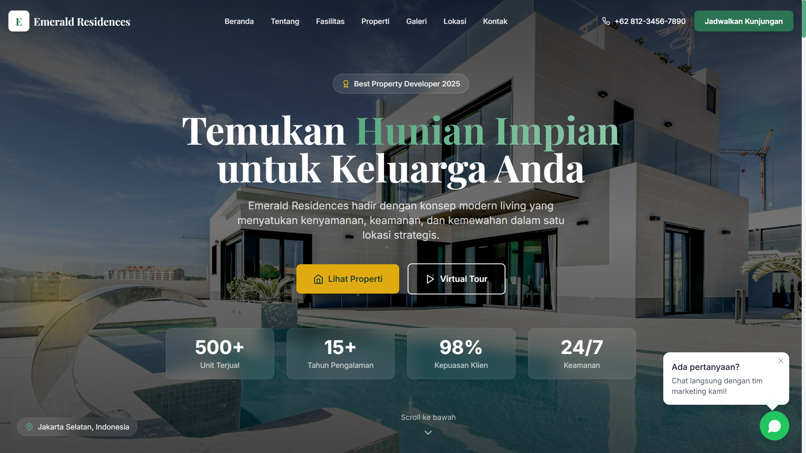

# Emerald Residences - Property Landing Page

A professional, responsive, and modern landing page for a property developer. Built with Next.js 14, Framer Motion animations, and optimized for SEO.



## 🚀 Features

- **Modern Design**: Clean and professional UI with elegant animations
- **Fully Responsive**: Optimized for all devices (mobile, tablet, desktop)
- **SEO Optimized**: Meta tags, Open Graph, structured data, sitemap
- **Smooth Animations**: Powered by Framer Motion
- **Interactive Components**:
  - Sticky navigation with scroll effects
  - Property showcase cards
  - Image gallery with lightbox
  - Testimonial slider
  - Contact form with validation
  - WhatsApp floating button
  - Google Maps integration

## 🛠️ Tech Stack

- **Framework**: Next.js 14 (App Router)
- **Styling**: Tailwind CSS
- **Animations**: Framer Motion
- **Icons**: Lucide React
- **Language**: TypeScript

## 📁 Project Structure

```
property-landing-page/
├── app/
│   ├── globals.css
│   ├── layout.tsx
│   ├── page.tsx
│   ├── robots.ts
│   └── sitemap.ts
├── components/
│   ├── layout/
│   │   ├── Navbar.tsx
│   │   └── Footer.tsx
│   ├── sections/
│   │   ├── Hero.tsx
│   │   ├── About.tsx
│   │   ├── Features.tsx
│   │   ├── Properties.tsx
│   │   ├── Gallery.tsx
│   │   ├── Testimonials.tsx
│   │   ├── Location.tsx
│   │   ├── CTA.tsx
│   │   └── Contact.tsx
│   └── ui/
│       └── WhatsAppButton.tsx
├── constants/
│   └── index.ts
├── lib/
│   └── utils.ts
├── types/
│   └── index.ts
└── public/
```

## 🚀 Getting Started

### Prerequisites

- Node.js 18.17 or later
- npm or yarn

### Installation

1. Clone the repository
2. Install dependencies:
   ```bash
   npm install
   ```
3. Run the development server:
   ```bash
   npm run dev
   ```
4. Open [http://localhost:3000](http://localhost:3000) in your browser

### Build for Production

```bash
npm run build
npm start
```

## ✨ Sections

1. **Hero**: Full-screen hero with animated elements and stats
2. **About**: Company overview with achievements
3. **Features**: 6 premium facility cards with icons
4. **Properties**: Property types with pricing and specs
5. **Gallery**: Filterable image gallery with lightbox
6. **Testimonials**: Customer reviews slider
7. **Location**: Google Maps integration with nearby places
8. **CTA**: Promotional section with offers
9. **Contact**: Form with validation and contact info
10. **WhatsApp Button**: Floating action button

## 🎨 Customization

### Colors
Edit `tailwind.config.ts` to customize the color palette:
- `primary`: Main brand color (emerald green)
- `gold`: Accent color for highlights

### Content
Update `constants/index.ts` to modify:
- Site configuration
- Navigation links
- Properties data
- Features list
- Testimonials
- Gallery images

## 📱 Responsive Breakpoints

- Mobile: < 640px
- Tablet: 640px - 1024px
- Desktop: > 1024px

## 🔧 SEO Features

- Dynamic meta tags
- Open Graph support
- Twitter cards
- robots.txt
- sitemap.xml
- Semantic HTML

## 📄 License

This project is created for portfolio demonstration purposes.

---

Built with ❤️ by [Codeardi](https://codeardi.com)
